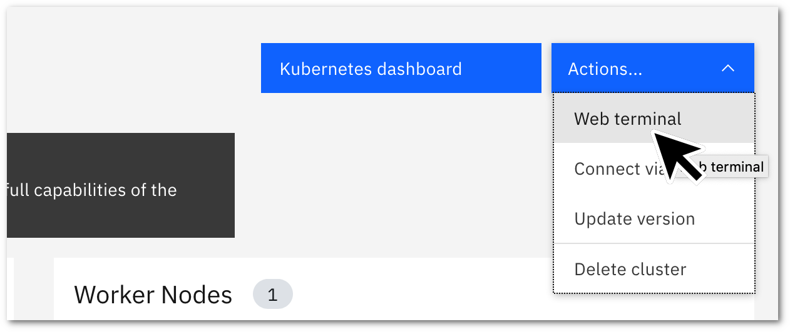

# Lab setup - get web terminal and content

You will already need an IBM Cloud account and an IBM Kubernetes Service cluster (free or paid) in order to proceed.

## Set up the web terminal

Log in to the [IBM Cloud](https://cloud.ibm.com) to access the dashboard.

Click on the top left navigation menu and select **Kubernetes**.


Open the control panel for your cluster by clicking on the name.


Select the **Web terminal** option from the Actions menu in the upper right of the control panel.



Click on the **Install** button if prompted (this won't be shown if the terminal is already installed). Getting the terminal ready will take a couple of minutes. If you click on the **Web terminal** button before it's ready you will see:


Open the web terminal - it will initially display at the bottom of the browser panel. Click on the expand button to open the terminal in a full browser tab:


Run the `ibmcloud ks clusters` command to verify the terminal and setup for access to the cluster

```text
ibmcloud ks clusters
```

> it's ok to ignore warnings you may see about versions of plugins or kubernetes cluster versions


Configure the `kubectl` cli available within the terminal for access to your cluster.

```text
eval $(ibmcloud ks cluster-config --cluster mycluster --export)
```

Verify access to the Kubernetes API.

```text
kubectl get namespace
```

You should see output similar to the following, if so, then your're ready to continue.

```text
NAME              STATUS   AGE
default           Active   125m
ibm-cert-store    Active   121m
ibm-system        Active   124m
kube-node-lease   Active   125m
kube-public       Active   125m
kube-system       Active   125m
```

## Clone the lab repository

In some of the labs, you will be creating Kubernetes resources by applyig `.yaml` files representing the desired state for the resource. To save typing in all of that, clone the lab repository into your web terminal:

```text
git clone https://github.com/timroster/digidevcon-iks
```

you should see:

```text
Cloning into 'digidevcon-iks'...
remote: Enumerating objects: 61, done.
remote: Counting objects: 100% (61/61), done.
remote: Compressing objects: 100% (44/44), done.
remote: Total 61 (delta 13), reused 61 (delta 13), pack-reused 0
Unpacking objects: 100% (61/61), done.
```

Continue on to the [next exercise](../exercise-1/README.md).
